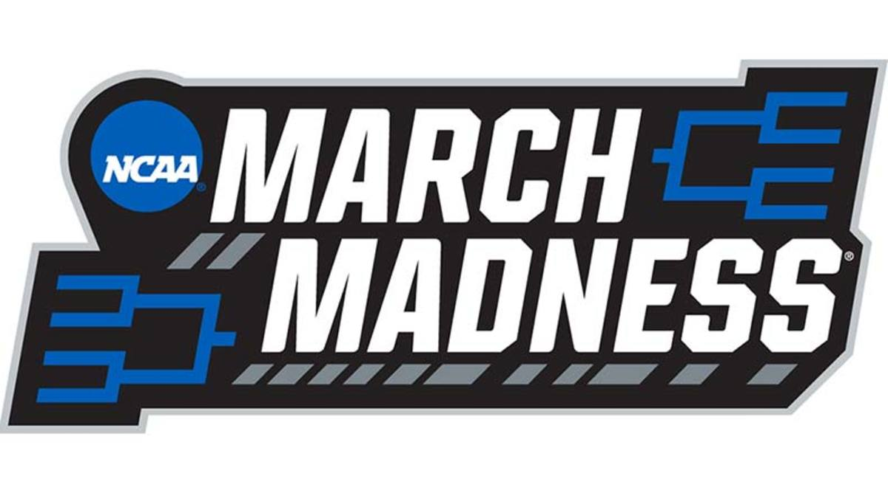

# March Madness

## Team Members: Adam, Faith, Wade and Yen

Project Overview: Create a NCAA betting game using a smart contract on Solidity platform and display it on Streamlit website.

Detailed Usage and installation instructions: 

Data Collection and Preparation:

Examples of the application or results:

Summary of the analysis: 

Note: Video of app?

Presentation: https://docs.google.com/presentation/d/1meHhTFnapBm_1EzukVolUBrP-xQTg6g2/edit?usp=share_link&ouid=112227308253472634696&rtpof=true&sd=true